# F13LD.foam — State-of-the-art periodic implicit foam

**Research summary and roadmap · 2026-10-04**

> **Status (end of 2026-10-04).** Phases 1–3 shipped in v0.6.0, apart from the explicit cell graph and Plateau-law relaxation:
> - exact field;
> - two-size Laguerre mix;
> - hyperuniform Lloyd + S(k);
> - lattice disorder, FCC / C15;
> - mirror / cubic seeds;
> - wet borders;
> - fillet / node.
>
> Next: rectangular tiles + Z / σ ([`NEXT_STEPS.md`](NEXT_STEPS.md) §3). Open ideas: NEXT_STEPS §4. The text below is the original proposal, kept as written.

Baseline: `mshomper/f13ld.foam` @ `3b8b948` (v0.5.0). Rule applied to every idea below: **it must be periodic by construction** — the tile repeats with no seam, so F13LD.mesh can tile it and F13LD.lab can homogenize it.

---

## 1. The short version

```mermaid
flowchart LR
  subgraph S["1 · Seeds (where cells are)"]
    S1["Poisson / Lloyd / random<br/>(today)"]
    S2["NEW: size-controlled<br/>Laguerre cells"]
    S3["NEW: order→disorder<br/>slider + more lattices"]
    S4["NEW: symmetric seeds<br/>(orthotropic / cubic)"]
  end
  subgraph T["2 · Tessellation"]
    T1["Voronoi (today)"]
    T2["NEW: Laguerre / power<br/>(per-cell weights)"]
    T3["NEW: Delaunay +<br/>hybrid struts"]
  end
  subgraph F["3 · Exact field (FoamField/2)"]
    F1["walls = nearest<br/>bisector plane"]
    F2["struts = nearest<br/>edge line / vertex"]
    F3["wet borders = rounded<br/>cell complement"]
  end
  subgraph O["4 · Out"]
    O1["F13LD.mesh 3MF"]
    O2["F13LD.lab FFT"]
  end
  S --> T --> F --> O
```

**Recommendation:** build the **exact field first** (Phase 1). It is small, it fixes a measured accuracy gap in today's strut field, and every new feature below (Laguerre weights, wet Plateau borders, rounded nodes, exact anisotropy) drops straight into it. The current approximation can't express weights or true Plateau-border cross-sections at all.

| Phase | What ships | Why it's "state of the art" | Effort |
|---|---|---|---|
| **1 — Exact field** | FoamField/2: exact walls, exact struts, weights + stretch built in. Lloyd cap raised + hyperuniformity read-out | Exact Euclidean thickness everywhere; Lloyd foams become measurably hyperuniform | M |
| **2 — Seeding** | Laguerre cells with a chosen size distribution; disorder slider from Kelvin/WP/FCC/C15; symmetric seeds | Matches how realistic foams are generated in the literature (packing → Laguerre → relax) | M–L |
| **3 — Topology** | Wet foam (true Plateau borders, one "liquid" slider); node blend; explicit graph → short-strut cleanup, strut taper, Delaunay & hybrid | Physically correct borders; printability control; stretch-dominated stochastic option | L |
| **4 — Research** | Sheet ("soft") foams, phase-intersected foam, inverse design toward target stiffness | Ties foam into PI-TPMS and Synth | Open |

---

## 2. Where the tool stands today (what I read)

- **Seeds** (`FoamSeeds`, shared byte-for-byte with mesh): saturated periodic Poisson-disk thinned to N, sampled Lloyd (≤12 iterations), uniform random, Weaire–Phelan (A15), Kelvin (BCC). Periodic via minimum-image distance.
- **Field** (`buildFoamSDF`, verbatim in foam, mesh worker and lab kernel): four nearest seeds; walls use `(d₂−d₁)/2`, struts use `(d₃−d₁)/2`, optionally divided by the gradient ("normalize") to approximate true distance; plateau and organic add smoothstep swell near edges/vertices.
- **Preview**: WebGL2 slice-per-draw bake of d₁…d₄ into an RGBA16F 3D texture, raymarched.

---

## 3. Measured finding: today's strut thickness is not uniform

I compared the current normalized field against the **exact** distance to the Voronoi walls and edges (200 periodic Poisson seeds, default thickness t = 0.08 tile units, i.e. 2t walls / t-radius struts). Samples taken in the band where the surface actually sits.

| Field | Error where the surface sits | Worst 5 % |
|---|---|---|
| Walls (closed), current | reads 0.0014 too far on average (≈ 2 % of t) | ≈ 4 % |
| **Struts (open/plateau), current** | **reads 0.0065 too close on average (≈ 8 % of strut radius)** | **≈ 33 % of radius** |
| Exact kernel, 6 neighbours | struts exact in 100 % of samples, rare 0.019 slips | — |
| **Exact kernel, 8 neighbours** | **walls and struts exact in 100 % of samples** | 0 |

What it means physically: struts swell unevenly — up to a third fatter — as they approach nodes, by an amount that depends on the local seed geometry rather than on any setting. Walls are already good where it matters. The organic and plateau sliders then add *intended* swell on top of this unintended swell, which is part of why plateau calibration is hard.

### The exact kernel (no explicit Voronoi diagram needed)

For a point p inside the cell of seed s₁, with neighbour seeds s_j:

- **Wall distance** — distance to the bisector plane of s₁ and s_j is
  `(|p−s_j|² − |p−s₁|²) / (2·|s_j−s₁|)`; the distance to the cell's boundary is the **minimum over j**. Exact for a convex cell, no gradient division.
- **Strut distance** — nearest point on any edge: for each pair of planes, the closest point on their intersection line (kept only if it lies inside all other planes), plus each vertex where three planes meet (kept if inside). Minimum of those.
- **Laguerre weights come free** — replace `|p−s|²` by the power distance `|p−s|² − w`; the bisectors stay planes.
- **Stretch (anisotropy) comes free** — with a stretched metric the bisectors are still planes in real space (normal = metric·(s_j−s₁)), so thickness is exact in real millimetres, not approximately normalized.

Cost: 8 nearest instead of 4; per sample ≈ 7 planes, 21 lines, 35 vertices, each checked against 7 planes (a few hundred multiply-adds). Trivial for the GPU bake; acceptable for mesh export in workers.

---

## 4. Seeding research (periodic-native)

### 4.1 Size-controlled Laguerre cells — *highest value*
Realistic foams are polydisperse. The standard route is **packing → Laguerre (power) tessellation → relaxation** (Kraynik's Surface Evolver foams), and Laguerre foams were among the models compared against soap froth in the Jang–Kraynik–Kyriakides stiffness study.

The modern, fast way to hit an exact cell-size distribution is **semi-discrete optimal transport**: Bourne, Pearce & Roper (2023) extended it to periodic boxes — a damped Newton solve for the weights that gives *exactly* the requested cell volumes, alternated with Lloyd steps for rounder cells. They report 10,000 grains in ≈ 18 s in MATLAB; at F13LD's ≤ 1,024 seeds this is sub-second in JS.

What the user would see: a **cell size distribution** control (lognormal spread, or bimodal: two sizes + mix ratio), with a histogram. Periodic by construction.

### 4.2 Hyperuniform foams — *cheap win*
Klatt et al. (Nat Commun 2019) showed Lloyd-converged Voronoi structures quickly become **effectively hyperuniform** — long-range density fluctuations are suppressed. Chen & Torquato found stealthy-hyperuniform networks reach near-optimal conductivity and bulk modulus against Hashin–Shtrikman bounds.

So the existing Lloyd mode already heads there; it is capped at 12 iterations. Proposal: raise the cap, and add a **structure-factor plot S(k)** (exact for a periodic box, N ≤ 1,024 is instant) so you can *see* the low-k dip appear. Full stealthy-hyperuniform optimization (collective coordinates) can come later; it is also natively periodic.

### 4.3 Order → disorder slider + more lattices
Lucarini (2009) perturbed SC/BCC/FCC seeds with growing noise: **BCC (Kelvin) keeps its 14-faced cells up to a noise of ≈ 0.1**, while SC and FCC change topology immediately; past ≈ 0.5 all become indistinguishable from random. That's a designer-friendly **"disorder" slider** with a known stable zone.

Lattice additions that tile the cube: **FCC** (rhombic dodecahedra, 4/cube), **C15 Laves** (24/cube, Frank–Kasper), **diamond** (8/cube). Weaire–Phelan (A15) remains the best-known equal-volume foam; Z and σ Frank–Kasper foams need non-cubic tiles (see §7).

### 4.4 Symmetric stochastic seeds — *my proposal, not from literature*
Generate seeds in one octant (or a 1/48 wedge) and mirror them. Mirror symmetry in x, y, z guarantees an **orthotropic** stiffness tensor (no stretch–shear coupling); adding the x↔y↔z permutation guarantees **cubic** symmetry (3 constants). Random-looking, but the homogenized tensor is clean and more predictable to calibrate — useful for implants. Mirrored tiles are automatically periodic. Poisson spacing must be enforced across the mirror planes.

### 4.5 Other blue-noise methods (lower priority)
Farthest-point optimization (Schlömer 2011) maximizes minimum spacing beyond Poisson; blue noise through optimal transport (de Goes 2012) is the same power-diagram machinery as 4.1 — worth sharing code rather than adding separately.

---

## 5. Topology research (what material sits on the cells)

### 5.1 Wet foam — true Plateau borders — *signature feature*
In real foams the material collects in **Plateau borders**: struts with concave triangular cross-sections (three circular arcs) meeting at tetrahedral nodes. Implicitly this is exact and simple with the kernel in §3:

> Shrink each cell inward by r, round it back out by r; the material is everything **not** inside a rounded cell.

One **liquid slider** then spans thin open-cell → wet foam → nearly closed; combined with a wall thickness it gives closed-cell foam with borders (how real polymer/metal closed-cell foams look). This would replace the current smoothstep "plateau" swell for new recipes — physically correct instead of a shaped bump. Old recipes keep the old field.

### 5.2 Node blending
Smooth union at nodes with its own radius (OpenVCAD exposes a "member blend radius"). Reduces stress concentration; independent of strut radius.

### 5.3 Explicit periodic graph → printability and per-strut control
Computing the actual vertices/edges/faces once (halfspace clipping per cell; a voro++ WebAssembly port, voro3d, also exists) unlocks:
- **Short-strut cleanup**: random Voronoi produces very short edges that print as blobs; collapse edges shorter than a mm threshold (uses existing `tile_mm`).
- **Strut taper** toward nodes (cross-section varying along length, as observed in real open-cell foams).
- **Read-outs**: faces per cell (random monodisperse soap froth ≈ 13.7), edge-length histogram, minimum strut length in mm.
- **Delaunay struts** (seed-to-seed, connectivity ≈ 14 → stretch-dominated) and **Voronoi + Delaunay hybrid** — standard in nTop and OpenVCAD stochastic lattices, and periodic for free.

Recipes stay small: mesh and lab rebuild the graph deterministically from the seed positions already in the recipe.

### 5.4 Plateau-law relaxation (later)
Move vertices toward 109.47° / 120° angles (a light stand-in for Surface Evolver). Jang–Kraynik–Kyriakides found relaxed soap-froth foams softer than Voronoi and less sensitive to polydispersity — a meaningful, measurable option once lab calibration catches up.

---

## 6. Compute research

- **Exact kernel on GPU** — same WebGL2 slice bake, but 8 neighbours; output either the final field or (walls, struts, vertex distances) channels. Optional WebGPU compute path later; not required.
- **Weights solver (§4.1)** — CPU, per-cell clipping gives exact cell volumes and the Hessian; Newton converges in tens of iterations at N ≤ 1,024.
- **S(k)** — direct sum over seeds at the periodic wavevectors 2πn/L.
- **Sheet / soft foams (research)** — smooth-minimum of the exact plane distances gives bicontinuous, TPMS-like stochastic sheets; intersecting two such sheet fields from different seed sets is the stochastic analogue of PI-TPMS pipe networks.
- **Inverse design (research)** — differentiable (soft) Voronoi lets seeds be nudged toward a target stretch or stiffness, trained against F13LD.lab runs and fed through Synth.

---

## 7. Guardrails and cross-tool impact

- **Three copies of the field** (foam `index.html`, mesh `worker/m25-sdf-foam.js`, lab `13d-foam-kernel.js`) plus `validate-foam.js` must change together. Proposal: add `geometry.field: "FoamField/2"`; recipes without it keep the v1 field exactly, so every existing handoff and calibration stays valid.
- **FoamSeeds** stays byte-identical with mesh; new modes bump `FoamSeeds.VERSION` and extend `tests/foamseeds.js`.
- **Minimum image**: with ≥ 50 seeds the 8 nearest are distinct seeds; add a guard so a tiny count can't pull the same seed twice.
- **Stiffness estimate**: every new mode is flagged "not calibrated" until lab runs exist — same policy as Kelvin/WP today.
- **Non-cubic tiles** (needed for Z/σ foams, and handy for slender parts) would touch the domain convention across mesh and lab — deferred unless you want it.
- **No part-scale gradients** — consistent with dropping gradients from TPMS; anything graded must repeat within the tile.

---

## 8. Decisions (answered 2026-10-04)

- **Exact field first:** yes.
- **Wet foam:** a fourth mode, since it changes the structure.
- **Cell sizes:** a two-size mix.
- **Symmetric seeds:** both mirror and cubic.
- **Non-cubic tiles:** yes, as long as they tessellate; the lab only takes cubic samples.
- **Seed count:** capped near 500, with the minimum pushed down (8–500 shipped; lattices down to one cube).
- **Organic:** replaced by a true fillet plus a node-size control.

---

## Sources

- Bourne, Pearce, Roper — *Geometric modelling of polycrystalline materials: Laguerre tessellations and periodic semi-discrete optimal transport*, Mech. Res. Commun. 127 (2023). https://eprints.gla.ac.uk/288006/1/288006.pdf
- Bourne, Kok, Roper, Spanjer — *Laguerre tessellations and polycrystalline microstructures: a fast algorithm for generating grains of given volumes* (2020). https://arxiv.org/pdf/1912.07188
- Klatt et al. — *Universal hidden order in amorphous cellular geometries*, Nat. Commun. 10 (2019). https://ideas.repec.org/a/nat/natcom/v10y2019i1d10.1038_s41467-019-08360-5.html
- Chen & Torquato — *Multifunctional hyperuniform cellular networks: optimality, anisotropy and disorder* (2018). https://ar5iv.arxiv.org/html/1808.02553
- Lucarini — *Three-dimensional random Voronoi tessellations: from cubic crystal lattices to Poisson point processes*. https://arxiv.org/pdf/0805.2705
- Jang, Kraynik, Kyriakides — random open-cell foam microstructure and stiffness (UT Austin seminar summary). https://sites.utexas.edu/cmssm/seminars/archived/2014-15/the-effect-of-microstructure-on-the-stiffness-of-random-open-cell-foams/
- Kraynik — random foam structure from Surface Evolver (CECAM). https://users.aber.ac.uk/sxc/CECAM/Kraynik_CECAM.pdf
- *Quasicrystalline three-dimensional foams* (Frank–Kasper comparisons). https://ar5iv.arxiv.org/html/1610.09286
- Schlömer, Heck, Deussen — *Farthest-point optimized point sets with maximized minimum distance* (2011). https://graphics.uni-konstanz.de/publikationen/Schloemer2011FarthestpointOptimized/index.html
- de Goes et al. — *Blue noise through optimal transport* (2012). https://history.siggraph.org/?p=207999
- OpenVCAD — stochastic Voronoi and Delaunay lattices. https://matterassembly.org/OpenVCAD-Docs/v3/guides/metamaterials/stochastic-lattices.html
- nTop — Delaunay lattice. https://docs.ntop.com/lessons/intro-to-lattices/delaunay-lattice
- Groth et al. — *Five simple tools for stochastic lattice creation* (2022). https://nottingham-repository.worktribe.com/output/7057561
- voro3d (voro++ WebAssembly wrapper). https://npmjs.org/package/voro3d
